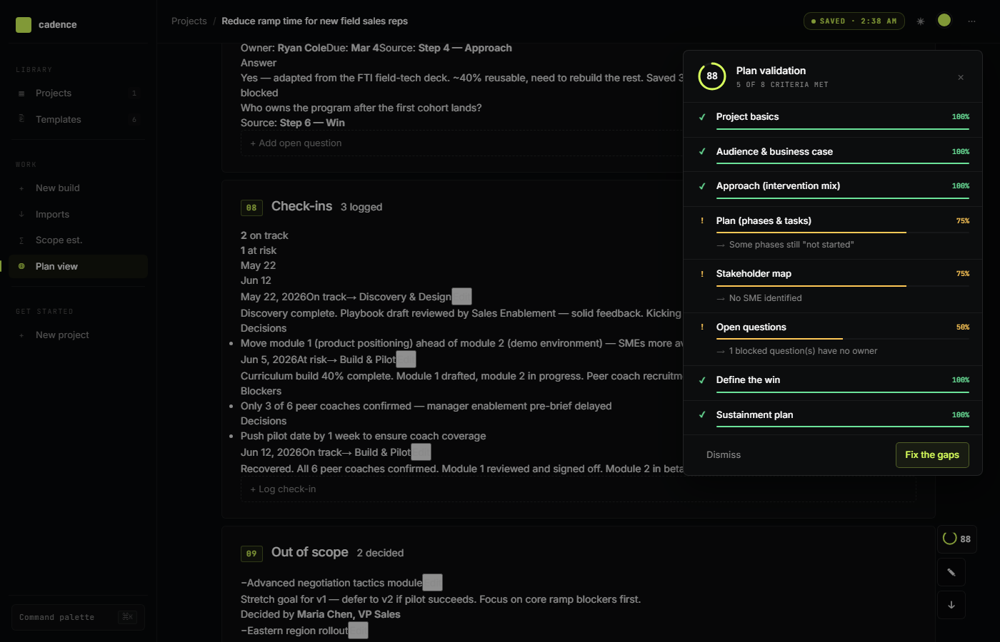
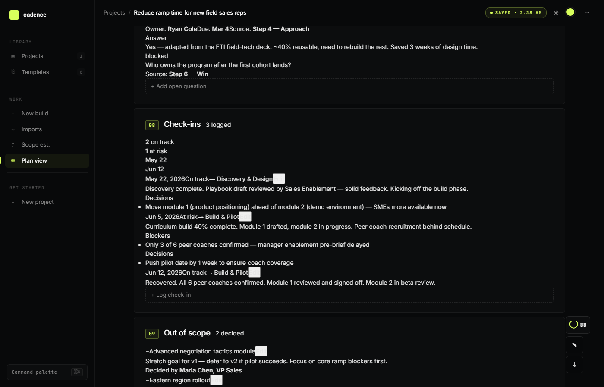

# Cadence

A local-first project planner for Talent Development Professionals. Walk six steps, get a one-pager you can hand to anyone.

**Try it in your browser:** [learn-cadence.netlify.app](https://learn-cadence.netlify.app/). No install required. Or download and run it locally (see Quick start below) if you want your projects to stay on your own device.

No accounts. No hosting. No "your data is in the cloud, trust us." Open the file, build the plan, email it to your VP. Done.


## Why it exists

Most L&D tools help you build the course. Cadence helps you build the **project plan that the work actually needs**.

A talent development professional's job is mostly the front of the project. Scoping. Diagnosing. Getting stakeholder alignment. Deciding what kind of intervention fits. The hard part is not the instructional design, it is the plan that makes the work real. Cadence structures that thinking. The course still needs to be good, but the project plan is what determines whether the course ships, lands well, and survives past launch.

Cost is a field you can fill in. It is not the throughline. The point is producing a project plan that is honest about the work, surgical about the scope, and defensible in a stakeholder meeting. If the plan is tight, the budget conversation takes care of itself.

## Quick start

**Open the file.** That is the install.

```
# Just open index.html in a browser
# Or run a local server (some browsers restrict JS over file://):
python3 -m http.server 8513
# Then open http://localhost:8513/index.html
```

On first load you will see the dashboard with a "Try sample" button. Click it to load a fully populated Performance Gap project you can explore, edit, or delete.

## The 6 templates

Each template is tuned to a different kind of L&D project:

| Template | When to use it |
|---|---|
| **Performance Gap** | A team is underperforming. Diagnostic. Forces the "is this even a learning problem" question. |
| **Onboarding** | New role or new hire ramp. 30/60/90 anchors. |
| **New System Rollout** | Software or process change. Adoption-focused. |
| **Leadership Development** | Cohort-based leader building. Behavior and milestone focused. |
| **Compliance** | Required training. Coverage, retention, and audit-ready proof. |
| **Course Development** | ADDIE-flavored. Pre-loads the 4-phase structure (PM, Design, Development, Implementation) and 6 review checkpoints. |

Each template pre-loads the prompts, sections, and measurement framework that fit the work.

## How to use it

### 1. Pick a template

Click **+ New project** on the dashboard. Pick the template that matches your work. Do not force a Performance Gap project into the Onboarding template just because they look similar. The prompts are tuned, and the tuning is the point.

### 2. Walk the 6 steps

Each template has 6 guided steps. The hardest questions ("is this even a learning problem?", "what did you rule out?", "what does success look like?") are baked into the prompts. They are not there to slow you down. They are there to keep the plan honest when a stakeholder asks "why this approach?"


You can **Save and exit** at any step. Your work is auto-saved (debounced 400ms) as you type.

### 3. View the one-pager

When you finish, you land on the plan view. This is the deliverable you will hand to stakeholders. It is editable inline: click any text to change it.


The plan view has 8 sections plus a dashboard at the top:

1. **Dashboard**: metrics row (phases done, hours, open questions, etc.) and a visual phase timeline.
2. **Problem**: the issue in plain terms.
3. **Root cause**: evidence you ruled out non-learning causes.
4. **Approach**: intervention mix (with editable amounts for scope estimation).
5. **Deliverables**: what the L&D team will ship.
6. **Plan**: phases, tasks, owners, dates, RACI, risks.
7. **Win**: success metrics, review cadence, sustainment.
8. **Open questions**: unknowns tracked with owner, due, and status.
9. **Check-ins**: project health over time (added as the project runs).
10. **Out of scope**: things considered and rejected.

### 4. Validate the plan

Click the **score ring** in the bottom-right of the plan view. You will get a 0-100 score across 8 criteria (project basics, audience, approach, plan, stakeholder map, open questions, win, sustainment) with specific gaps to fix.



Click **Fix the gaps** to jump straight to the field that needs work. The wizard highlights gap fields in red with a "needs fix" tag.

### 5. Estimate scope

Click **∑ Scope** in the section nav. The scope estimator turns "how much work is this?" into a defensible number using ATD-defaulted hours-per-deliverable ratios (editable in the benchmark table).


If you have amounts in your intervention mix, the estimator will auto-fill from those. Otherwise add deliverables from the benchmark list and enter unit counts. The estimator applies a Design, Develop, Review, Revise split and writes the total to the project.

### 6. Track check-ins

As the project progresses, scroll to section 08 **Check-ins** in the plan view and log status updates. Each check-in has a date, status (on-track, at-risk, or blocked), notes, blockers, and decisions. The timeline strip at the top of the section shows project health over time.



### 7. Export

Click the **↓** button in the bottom-right of the plan view. You get five options:

| Export | What it is | Edit after export? |
|---|---|---|
| **Slide deck (reveal.js)** | Self-contained HTML with reveal.js. Arrow keys to navigate, Esc for overview, F for fullscreen. | Yes. Open in any text editor, edit the `<section>` blocks. |
| **PPTX** | Editable PowerPoint. Your accent color is embedded in the theme. Text is fully editable. | Yes. Opens in PowerPoint, Keynote, Google Slides. |
| **Standalone HTML** | Single self-contained file. The full plan as a scrollable webpage. Carries your accent, theme, and all sections. | Limited. It is a generated page. |
| **PDF** | Prints the current plan view page. | No |
| **JSON** | Raw project data. Re-importable into Cadence. | Yes. Edit the JSON and re-import. |

## Data model

A project is a single JSON object in IndexedDB:

```json
{
  "id": "p_abc123",
  "templateId": "performance-gap",
  "createdAt": 1700000000000,
  "updatedAt": 1700000000000,
  "fields": {
    "title": "Reduce ramp time for new field sales reps",
    "sponsor": "Maria Chen, VP Sales",
    "problemHeadline": "Reduce ramp time from 90 to 60 days",
    "interventions": [
      { "value": "ilt", "amount": 6, "detail": "4 × 90-min modules" }
    ],
    "phases": [...],
    "openQuestions": [...],
    "checkIns": [...],
    "outOfScope": [...]
  }
}
```

Edits auto-save to IndexedDB every 400ms. Closing the tab does not lose your work.

## The 8 validation criteria

The plan score (0-100) is the average of 8 criteria:

| Criterion | What it checks |
|---|---|
| **Project basics** | Title and sponsor filled |
| **Audience & business case** | Role, size, and baseline cost |
| **Approach** | ≥1 intervention with numeric amount |
| **Plan** | Phases with dates, tasks with owners, statuses |
| **Stakeholder map** | Sponsor, doer, SME, resister or champion |
| **Open questions** | ≥1 tracked, none blocked without owner |
| **Define the win** | Metrics and review cadence |
| **Sustainment plan** | Post-launch owner or handoff plan |

## Architecture

Three files, no build step:

```
cadence/
├── index.html       # Design system, inlined React app (Babel-transformed in browser), all features
├── templates.js     # The 6 templates (data, prompts, sections, default phases)
├── benchmarks.js    # Scope estimator lookup (19 L&D deliverable types with ATD-defaulted hours/unit)
├── screenshots/     # README screenshots
├── PROPOSED_CHANGES.md  # Development history
└── LICENSE          # MIT
```

The app uses React 18 (UMD build) and Babel Standalone, both loaded from a CDN. The JSX is transformed in the browser. No npm install, no bundler, no build pipeline. The trade-off: in-browser Babel is slower than a precompiled bundle, but the file still loads and runs in under a second on a modern machine.

## Customization

### Change the accent color

Click the accent swatch in the topbar (next to the theme toggle). Pick any of 8 presets or use the custom hex picker. The accent flows through section numbers, the validate score ring, status pills, the slide deck, and the PPTX theme.

### Switch to light mode

Click the ☀/☾ button in the topbar. Light mode auto-darkens the accent color for legibility on light surfaces.

### Edit a template

Open `templates.js`. Each template has 5-6 steps. To add a template, append a new entry to `TEMPLATES`:

```js
'my-template': {
  id: 'my-template',
  name: 'My Template',
  tagline: 'What this is for.',
  accent: '#d8ff5c',
  steps: [
    {
      title: 'Project basics',
      prompt: 'Name the project, the sponsor, and the timeline.',
      fields: [
        { id: 'title', label: 'Project title', type: 'text', placeholder: 'e.g., ...' },
        // ... more fields
      ]
    },
    // ... more steps
  ]
}
```

Field types: `text`, `textarea`, `select`, `multiselect`, `list`, `stakeholders`, `phases`, `deliverables`, `businessCase`, `openQuestions`.

### Edit the benchmark table

Open `benchmarks.js`. Each row is an L&D deliverable type with a default hours-per-unit ratio. Adjust the values to match your organization's data.

## URL parameters for demos

- `?seed=1`: pre-loads a sample Performance Gap project on first load.
- `?seed=force`: clears existing data, then seeds the sample.
- `?seed=force&view=plan`: clears, seeds, navigates to the plan view.
- `?seed=force&view=build`: same, but to the build flow.
- `?seed=force&view=new`: same, but to the template picker.

## Limitations

- **No sync.** Projects live on one device. Email yourself the JSON or HTML export to move them.
- **No multi-user editing.** Cadence is single-user. Co-editing will overwrite each other.
- **No server.** That is the point. It also means no telemetry, no analytics, no auto-update.
- **CDN dependency for the app itself.** React and Babel load from a CDN. Works offline once loaded.
- **CDN dependency for the reveal.js slide deck export.** For offline presentations, download reveal.js and update the CDN links in the exported file (instructions in the file's comment block).

## License

MIT. See [LICENSE](LICENSE).
