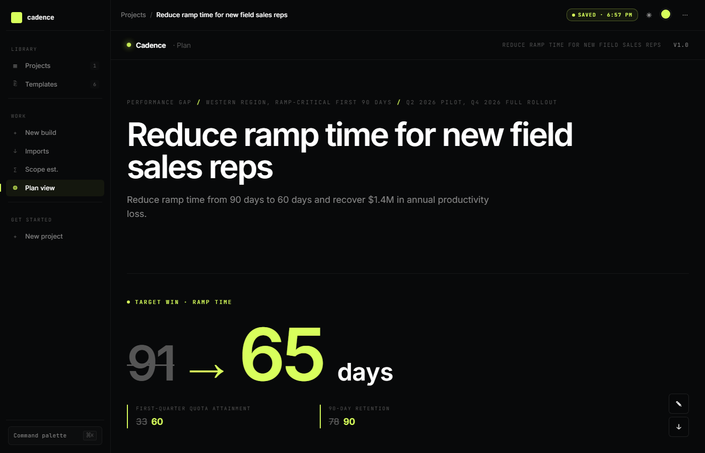
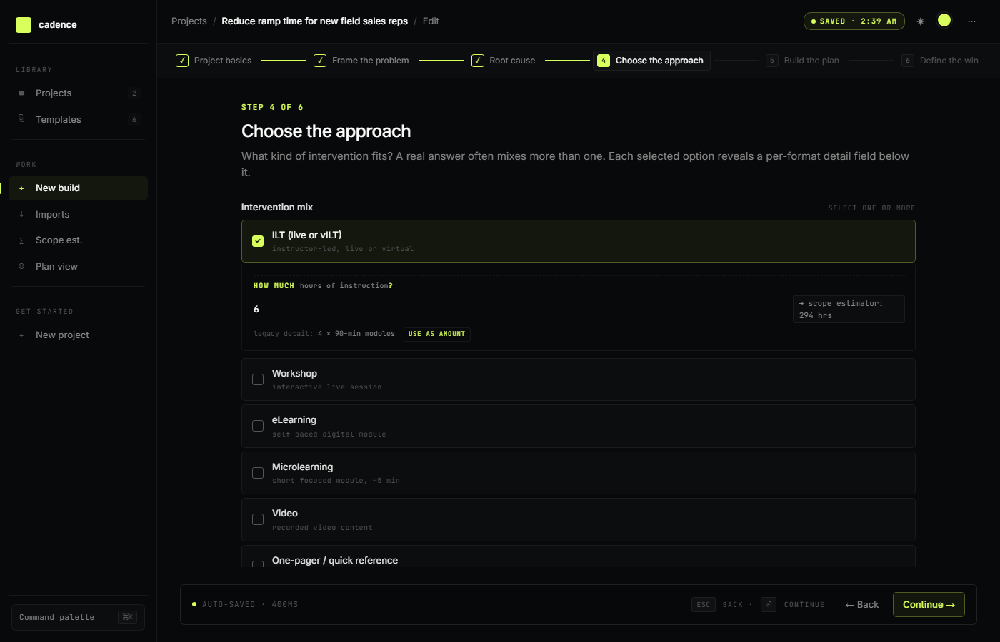
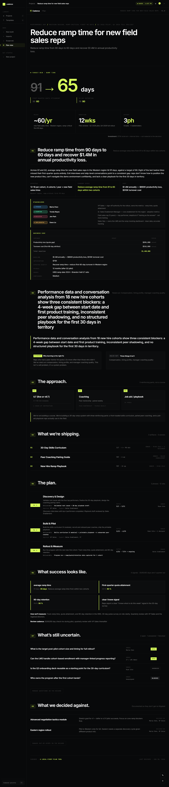
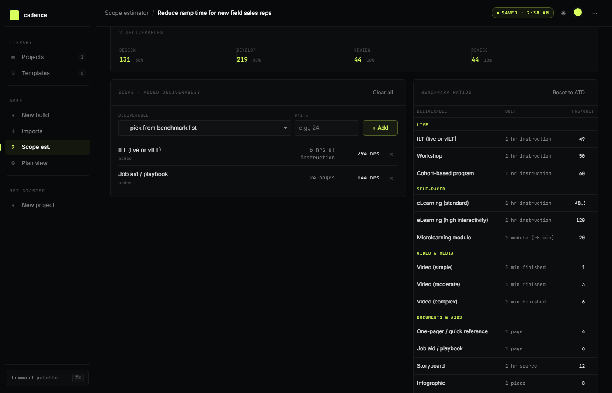

# Cadence

A local-first project planner for Talent Development Business Partners. Walk six steps, get a one-pager you can hand to anyone.

No accounts. No hosting. No "your data is in the cloud, trust us." Open the file, build the plan, email it to your VP. Done.



## Why it exists

Most L&D tools help you build the course. Cadence helps you build the *project plan* that gets the course funded.

A TDBP's job is mostly the front: scoping, diagnosing, getting stakeholder alignment, deciding what kind of intervention fits. The hard part isn't instructional design — it's the doc that lands the project. This tool structures that thinking.

## Quick start

**Open the file.** That's the install.

```
# Just open index.html in a browser
# Or run a local server (some browsers restrict JS over file://):
python3 -m http.server 8513
# Then open http://localhost:8513/index.html
```

On first load you'll see the dashboard with a "Try sample" button. Click it to load a fully-populated Performance Gap project you can explore, edit, or delete.

## The 6 templates

Each template is tuned to a different kind of L&D project:

| Template | When to use it |
|---|---|
| **Performance Gap** | A team is underperforming. Diagnostic. Forces the "is this even a learning problem" question. |
| **Onboarding** | New role / new hire ramp. 30/60/90 anchors. |
| **New System Rollout** | Software or process change. Adoption-focused. |
| **Leadership Development** | Cohort-based leader building. Behavior and milestone focused. |
| **Compliance** | Required training. Coverage, retention, and audit-ready proof. |
| **Course Development** | ADDIE-flavored. Pre-loads the 4-phase structure (PM → Design → Development → Implementation) and 6 review checkpoints. |

Each template pre-loads the prompts, sections, and measurement framework that fit the work.

## How to use it

### 1. Pick a template

Click **+ New project** on the dashboard. Pick the template that matches your work.

### 2. Walk the 6 steps

Each template has 6 guided steps. The hardest questions — "is this even a learning problem?", "what did you rule out?", "what does success look like?" — are baked into the prompts.



You can **Save and exit** at any step. Your work is auto-saved (debounced 400ms) as you type.

### 3. View the one-pager

When you finish, you land on the plan view — the deliverable you'll hand to stakeholders. It's editable inline: click any text to change it.


The plan view is a long-scroll document built to get approved. It opens with a sticky topbar, a hero with the project title and a one-line summary, then the **big win** — the headline number that makes the case (e.g. `91 → 65 days`) parsed from your first success metric. Below the win, a 3-stat strip shows **Reach**, **Duration**, and **Effort**. The 8 sections follow:

1. **Problem** — the issue in plain terms, with stakeholder map and business case breakdown
2. **Root cause** — evidence you ruled out non-learning causes
3. **Approach** — three reinforcing parts (the intervention mix), each linked to a deliverable
4. **Deliverables** — what the L&D team will ship (name, format, owner)
5. **Plan** — phases with owners, dates, and deliverables
6. **Win** — success metrics as a 2x2 card grid (each with from → to and rest)
7. **Open questions** — unknowns tracked with owner/due/status
8. **Out of scope** — things considered and rejected

The whole document is designed to be readable top-to-bottom in a single scroll — no dashboards, no check-ins, no execution tracking. Cadence is for *getting the plan approved*, not for running the project.



### 4. Estimate scope

Click **∑ Scope** in the section nav. The scope estimator turns "how much work is this?" into a defensible number using ATD-defaulted hours-per-deliverable ratios (editable in the benchmark table).



If you have amounts in your intervention mix, the estimator will auto-fill from those. Otherwise add deliverables from the benchmark list and enter unit counts. The estimator applies a Design/Develop/Review/Revise split and writes the total to the project.

### 5. Export

Click the **↓** button in the bottom-right of the plan view. You get five options:

| Export | What it is | Edit after export? |
|---|---|---|
| **Slide deck (reveal.js)** | Self-contained HTML with reveal.js. Arrow keys to navigate, Esc for overview, F for fullscreen. | Yes — open in any text editor, edit the `<section>` blocks |
| **PPTX** | Editable PowerPoint. Your accent color is embedded in the theme. Text is fully editable. | Yes — opens in PowerPoint, Keynote, Google Slides |
| **Standalone HTML** | Single self-contained file. The full plan as a scrollable webpage. Carries your accent, theme, and all sections. | Limited — it's a generated page |
| **PDF** | Prints the current plan view page. | No |
| **JSON** | Raw project data. Re-importable into Cadence. | Yes — edit the JSON and re-import |

## Data model

A project is a single JSON object in IndexedDB:

```json
{
  "id": "p_abc123",
  "templateId": "performance-gap",
  "createdAt": 1700000000000,
  "updatedAt": 1700000000000,
  "fields": {
    "title": "Reduce ramp time for new field sales reps",
    "sponsor": "Maria Chen, VP Sales",
    "problemHeadline": "Reduce ramp time from 90 to 60 days",
    "audienceReach": 60,
    "audienceReachUnit": "reps/yr",
    "interventions": [
      { "value": "ilt", "amount": 6, "detail": "4 × 90-min modules" }
    ],
    "phases": [...],
    "openQuestions": [...],
    "outOfScope": [...]
  }
}
```

Edits auto-save to IndexedDB every 400ms. Closing the tab doesn't lose your work.

## Architecture

Three files, no build step:

```
cadence/
├── index.html       # Design system, inlined React app (Babel-transformed in browser), all features
├── templates.js     # The 6 templates (data, prompts, sections, default phases)
├── benchmarks.js    # Scope estimator lookup (19 L&D deliverable types with ATD-defaulted hours/unit)
├── screenshots/     # README screenshots
├── PROPOSED_CHANGES.md  # Development history
└── LICENSE          # MIT
```

The app uses React 18 (UMD build) and Babel Standalone, both loaded from a CDN. The JSX is transformed in the browser. No npm install, no bundler, no build pipeline. The trade-off: in-browser Babel is slower than a precompiled bundle, but the file still loads and runs in under a second on a modern machine.

## Customization

### Change the accent color

Click the accent swatch in the topbar (next to the theme toggle). Pick any of 8 presets or use the custom hex picker. The accent flows through section numbers, the big win arrow, the stat strip, the slide deck, and the PPTX theme.

### Switch to light mode

Click the ☀/☾ button in the topbar. Light mode auto-darkens the accent color for legibility on light surfaces.

### Edit a template

Open `templates.js`. Each template has 5-6 steps. To add a template, append a new entry to `TEMPLATES`:

```js
'my-template': {
  id: 'my-template',
  name: 'My Template',
  tagline: 'What this is for.',
  accent: '#d8ff5c',
  steps: [
    {
      title: 'Project basics',
      prompt: 'Name the project, the sponsor, and the timeline.',
      fields: [
        { id: 'title', label: 'Project title', type: 'text', placeholder: 'e.g., ...' },
        // ... more fields
      ]
    },
    // ... more steps
  ]
}
```

Field types: `text`, `textarea`, `select`, `multiselect`, `list`, `stakeholders`, `phases`, `deliverables`, `businessCase`, `openQuestions`.

### Edit the benchmark table

Open `benchmarks.js`. Each row is an L&D deliverable type with a default hours-per-unit ratio. Adjust the values to match your organization's data.

## URL parameters for demos

- `?seed=1` — pre-loads a sample Performance Gap project on first load.
- `?seed=force` — clears existing data, then seeds the sample.
- `?seed=force&view=plan` — clears, seeds, navigates to the plan view.
- `?seed=force&view=build` — same, but to the build flow.
- `?seed=force&view=new` — same, but to the template picker.

## Limitations

- **No sync.** Projects live on one device. Email yourself the JSON or HTML export to move them.
- **No multi-user editing.** Cadence is single-user. Co-editing will overwrite each other.
- **No server.** That's the point — but it also means no telemetry, no analytics, no auto-update.
- **CDN dependency for the app itself.** React and Babel load from a CDN. Works offline once loaded.
- **CDN dependency for the reveal.js slide deck export.** For offline presentations, download reveal.js and update the CDN links in the exported file (instructions in the file's comment block).

## License

MIT. See [LICENSE](LICENSE).
